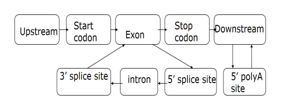
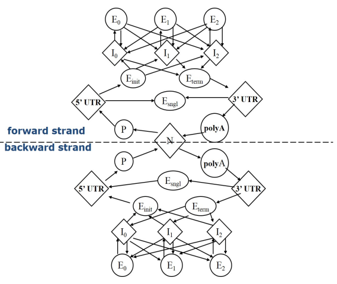

# Markov chain

## Random process

**Definition 2.1.1** For discrete time $t=0,1,2,3,\cdots$, every $t$ corresponds to a random variable $\xi_t(w)$. We call the sequence of $\xi=\xi_0,\xi_1,\xi, \xi_n, \dots$ as a **random process of discrete process**. All $\xi_t(w)$ has a public value set, called state space, denoted $S$.

**Definition 2.1.2** For a fixed $w$, $\xi(w)={\xi_0(w),\dots, \xi_n(w),\dots}$ is a sequence of states, called a **trajectory** of the random process. The value of $\xi_t(w)$ is called the state of the trajectory at time $t$.

**Definition 2.1.3** The united distribution of any finite $(\xi_{n_1}(w),\dots, \xi_{n_m}(w))$ is called a **finite dimensional distribution** of $\xi$. Its properties is discribed with all finite dimensional distribution of $\xi$.

## Definition and terms

Generally,
$$P(\xi_0,\dots, \xi_n)=P(\xi_0,\dots,\xi_{n-1})P(\xi_n\mid \xi_0,\dots, \xi_{n-1})=P(\xi_0)P(\xi_1\mid \xi_0)\dots P(\xi_n\mid \xi_0,\dots, \xi_{n-1})$$
Even if there are only two states, the parameters are: 
$$1+2+4+\dots+2^n=2^{n+1}-1$$
Another extreme condition is when all $\xi_i$ are independent:
$$P(\xi_0,\dots, \xi_n)=P(\xi_0)\dots P(\xi_n)$$
This only needs one parameter, but it's too simple.

**Definition 2.1.4** A random process with discrete time and discrete states $\{\xi_n(w),n\ge0\}$, with state space $S=\{s_1,s_2,\dots\}$ is called a **discrete-time Markov chain(MC)**, if
$$P(\xi_{n+1}=j\mid \xi_n=i,\xi_{n-1}=i_{n-1},\dots,\xi_0=i_0)=P(\xi_{n+1}=j\mid \xi_n=i)$$

**Definition 2.1.5** The conditional probability $P(\xi_{n+1}=j\mid \xi_n=i)$ is called the **transition probability** $p_{ij}^{(n)}$ at time t, and $P^(n)=(p_{ij}^{(n)})$ is called the **transition probability matrix**(abbreviated as TPM for convenience) at time n.

**Definition 2.1.6** If the transition matrix is independent of the time, the Markov chain is called **time homogeneous**. The transition probability matrix can be denoted $P=(p_{ij})$.

A random process is called a k-th-order Markov chain if 
$$\forall n;j,i+n,\dots,i_0, P(x_{n+1}=j\mid x_n=i_n,\dots,x_0=i_0)=P(x_{n+1}=j\mid x_n=i_n,x_{n-k+1}=i_{n-k+1})$$

Obviously zeroth-order Markov chain is a mutually independent random sequence. If not specially mentioned, a Markov chain is a first-order time homogeneous one.

## Properties of Markov chains

- $P(n,n)=I$
- $P(n,m)1^T=1^T$(normalization)
- $P(n,l)=P(n,m)P(m,l)$(C-K equation)

**Property 2.1.1** Time homogeneous Markov chain is fully determined by transition probability matrix and initial distribution. With TPM $P=(p_{ij})$ and initial distribution $\mu_i^{(0)}=P(\xi_0=i)$,
$$P(\xi_0=i_0,\xi_1=i_1,\dots,\xi_n=i_n)=\mu_0^{(0)}p_{i_0i_1}\dots p_{i_{n-1}i_n}$$

**Property 2.1.2** Denote $\mu_i^{(n)}=P(\xi_n=i), \mu^{(n)}=(\mu_i^{(n)}),i\in S$, then $\mu^{(n+m)}=\mu^{(m)}P^n$(absolute probability).

## Invariant distribution of Markov chains

**Definition 2.1.7** A distribution of state space $S$ is called an **invariant probability distribution** of TPM $P$, if $\pi P=\pi$. 

**Property 2.1.3** Generally, the invariant distribution may not exist. If the invariant distribution exists and is unique, then its the unique non-negative solution of the equation $\pi=\pi P$, $\pi 1^T=1^T$.

**Definition 2.1.8** A state $i$ is called a **reachable** to state $j$, if an index sequence $i_n$ exists, s.t. $\exists n>0, (P^n)_{ij}>0$.

**Definition 2.1.9** State $i$ and state $j$ is called **interconnected**, if each other is reachable to another.

**Definition 2.1.10** If all states are interconnected, the state space is called **inreducible**.

It can be proved that the necessary and sufficient condition of matrix reducibility is that there exists some permutation of rows and colomns s.t. the matrix can be written as 
$$\begin{pmatrix}
E &F \\ 0 &G
\end{pmatrix}$$

**Definition 2.1.11** State $y$ of Markov chain $\{\xi_n(w):n\ge 0\}$ is called **recurrent**, if: $\Pr(\exists n>0 \text{ }s.t.\xi_n=y\mid \xi_0=y)=1$. The state $y$ is called a **recurrent state**, and **temporary state** for opposite.

**Definition 2.1.12** For any states $i,j$ for a Markov chain, define the **first entrance time** from i to j as a random variable:
$$T_{ij}(w)=\begin{cases}
min\{n:\xi_0=i,\xi_n=j\},& \text{the set is not empty}\\
+\infty,&\text{empty set}
\end{cases}$$

**Definition 2.1.13** Further, define $f_{ij}(n)=\Pr(T_{ij}=n\mid \xi_0=i)$ as the **first entrance probability** from i to j.

**Definition 2.1.14** The **limited entrance probability** is the sum: $f_{ij}^*=\sum_{n=1}^\infty f_{ij}(n)=\Pr(T_{ij}<+\infty\mid \xi_0=i)$.

**Property 2.1.4** Then, the n-step transition probability of any states $i,j$ can be factorized by first entrance:
$$p_{ij}(n)=\sum_{k=1}^n f_{ij}(k)p_{ij}(n-k)$$

**Definition 2.1.15** For a recurrent state $i$, consider an n-stap process from i to i. Define $gcd(\{n:(p^n)_{ii}>0\})$ as the **period** $T$ of state $i$. If $T>1$ state $i$ is called **periodic**, otherwise unperiodic.

**Theorem 2.1.1**(Ergotic Theorem) Consider a Markov chain $\{\xi_n(w):n\ge 0\}$ with TPM $P$. The average limit of n-step transition probability $\lim_{n\rightarrow \infty}\frac{1}{n}\sum_{k=1}^n P^k$ exists. Denote the limit as L, then $PL=LP=L=L^2$. The elements is:
$$L_{ij}=\begin{cases}
\pi_j& \text{i,j is in the same recurrent class}\\
0& \text{j is temporary, or i,j is not in the same recurrent class}\\
f^*_{ij}\pi_j& \text{j is current but i is temporary}
\end{cases}$$

For a interconnected recurrent Markov chain, 
$$\lim_{n\to \infty}\frac{1}{n}\sum_{k=1}^n P^k\to (1,\dots,1,\dots)^T(\pi_1,\dots,\pi_N,\dots)$$
$\pi_i$ is either all positive or all 0.

**Theorem 2.1.2**(Exponential ergotic theorem) If the state space S of a MC is finite and all elements of the TPM is positive, there uniquely exists a invariant probability distribution $\vec{\pi}=(\pi_1,\dots,\pi_n)$ which satisfies 
$$\sum_k \pi_kp_{kj}=\pi_j,\pi_j\ge\delta\\
\mid p_{ij}(n)-\pi_j\mid \le(1-N\delta)^n$$
where $\delta=\min_{i,j}\{p_{ij}\}\le 1/N$

**Definition 2.1.16** Define $\mu_i=E(T_{ii}(w))$ as the average return time.

**Property 2.1.5** For an interconnected MC, $\mu_i=1/\pi_i$(invariant distribution).

# Applications of Markov chains

## Average sentence length

**Question:** Assume that every character(A C G T) in DNA sequence is independently identically distributed(i.i.d) with probability $(P_A,P_C,P_G,P_T)$. Now there is a kind of endonuclease which cleaves the sequence at AA. Whats the average length of the fragments?

**Building MC:** The state space is $\{A,B,AA\}$, the state of position-n as ending. Denote $P_A$ as $p$ and $q=1-p$, the TPM is:
$$\begin{pmatrix}
0&q&p\\ p&q&0\\ p&q&0
\end{pmatrix}$$
The invariant distribution can be solved: $\vec{\pi}=(\frac{p}{1+p},q,\frac{p^2}{1+p})$. The everage length is then $\frac{1+p}{p^2}$.

## Pagerank algorithm

**Basic idea:** Suppose that there a set of pages with hyperlinks to other pages. Denote the probability of page d as $\Pr(d)$, then if page a contains 10 hyperlinks and page b contains only one hyperlink to c, the contribution of b to $\Pr(c)$ is greater than a. Naturally, a weight is allocated $w_{de}=1/L(d)$ where $L(d)$ is the number of hyperlinks from d. This weight can be viewed as the probability of page-d-viewers going to page e. $1/L(d)$ corresponds to a *random surfer model*.

**Calculation and MC model:** From the previous discussion of weight and the intrinsic weight from probability, $\Pr(d)=\sum_{e\in R(d)}\Pr(e)w_{ed}$ where R(d) is the set of pages linking to d. The recursive behaviour is then $\Pr_{n+1}(d)=\sum_{e\in R(d)}\Pr_n(e)w_{ed}$. Notice that $\sum_j w_{ij}=1$, $W=(w_{ij})$ can be treated as the TPM of a MC. The invariant distribution is then the eigenvector of W.

**Damping factor:** There is a probability that user stop clicking links and randomly open another page. The damping factor is the probability of user clicking. Taking into account the damping factor, $\Pr(d)=\frac{1-\alpha}{N}+\alpha\sum_{e\in R(d)}\Pr(e)w_{ed}$.

# Hidden Markov Model(HMM): Definition

The HMM model considers a MC of hidden states and a sequence of observed states determined by hidden states. It contains:

- Hidden process $X=\{X_1,\dots, X_T\}$
- Observed process $Y=\{Y_1,\dots,Y_T\}$
- Parameters $\lambda=\{\pi,A,B\}$
    - Initial distribution $\pi=(\pi_i), \pi_i=\Pr(X_1=i)$
    - TPM $A=(a_{ij})$
    - Emission probability matrix $B=(b_{ij}),b_{il}=\Pr(Y_n=l\mid X_n=i)$
    - Total number of parameters is $(N-1)+N(N-1)+N(M-1)$ with N states and M observable notations.

The mathematical problem of HMM includes:

- Identification problem: Given some HMMs and their parameters, for a specific sample, decide which model it comes from.
- Decoding problem: Getting hidden states from observations.
- Learning problem: Getting parameters from observations.

# Algorithms of HMM

## Identification problem

Given some HMMs and their parameters, the identification problem is a problem of Bayesian judgement with given samples. Calculate the probability of the given sample happening in every model $P(Y\mid \lambda)$. After normalization, the probability of the sample happening in any model $P(\lambda\mid Y)$:
$$P(Y=y\mid \lambda)=\sum_{x}P(Y=y\mid X=x,\lambda)P(X=x\mid \lambda)=\sum_{x=(x_1,\dots,x_T)}\pi(x_1)b_{x_1}(y_1)(\prod_i a_{x_1x_{i+1}}b_{x_{i+1}}(y_{i+1}))$$

Enumeration gives a complexity of $2TN^T$, which is absolutely too large. There then algorithms with polynomial-complexity. (The essence of the aogorithms is to sacrifice space for time.)

### Forward algorithm

Core: the hidden state $x_{t+1}$ is only determined by hidden state $x_t$. Denote 
$$\alpha_t(i)=\Pr(y_1,\dots,y_t,x_t=i\mid \lambda)$$
Then the hidden state of the next time step is calculated by adding all possible history paths:
$$\begin{aligned}
\alpha_{t+1}(i)=&\Pr(y_1,\dots,y_{t+1},x_{t+1}=i\mid \lambda)\\
=&\sum_j\Pr(y_1,\dots,y_{t+1},x_t=j,x_{t+1}=i\mid \lambda)\\
=&\sum_j\Pr(y_1,\dots,y_t,x_t=j\mid \lambda)\Pr(y_{t+1},x_{t+1}=i\mid x_t=j,\lambda)\\
=&\sum_j\alpha_t(j)a_{ji}b_i(y_{t+1})
\end{aligned}$$

The algorithm includes three steps:

- Initialization: $\alpha_1(i)=\pi_ib_i(y_1)$
- Recursion: $\alpha_{t+1}(i)=\sum_j\alpha_t(j)a_{ji}b_i(y_{t+1})$
- Result: $\Pr(Y\mid \lambda)=\sum_{i=1}^N \alpha_T(i)$

### Backward algorithm

Just like Forward algorithm,
$$\begin{aligned}
\beta_t(i)=&\Pr(y_{t+1},\dots,y_T\mid x_t=i,\lambda)\\
=&\sum_j\Pr(y_{t+1},\dots,y_T,x_{t+1}=j\mid x_t=i,\lambda)\\
=&\sum_j\Pr(y_{t+2},\dots,y_T\mid x_{t+1}=j,\lambda)\Pr(y_{t+1},x_{t+1}=j\mid x_t=i,\lambda)\\
=&\sum_j\beta_{t+1}(j)a_{ij}b_j(y_{t+1})
\end{aligned}$$

Three steps are:

- Initialization: $\beta_T(i)=1$
- Recursion: $\beta_t(i)=\sum_j\beta_{t+1}(j)a_{ij}b_j(y_{t+1})$
- Result: $\Pr(Y\mid \lambda)=\sum_{i=1}^N\beta_1(i)\pi_ib_i(y_1)$

## Decoding problem

Given the observation sequence $Y=(y_1,\dots,y_T)$, the decoding problem is to find the hidden state sequence X'. There are two 'best': 
- single-point best, i.e. $X_t'=\operatorname{Argmax}_i \Pr(X_t=i\mid Y)$
- path best, i.e. $\forall X,\Pr(X'\mid Y)\ge \Pr(X\mid Y)$

Because the observation sequence is given, the problem is equivalent to finding X' to make $\Pr(x_1,\dots,x_T;y_1,\dots,y_T)$ max.

### single point best

The algorithm is: based on the target site, calculate the probability by extending to the two ends.
$$\begin{aligned}
\gamma_t(i) &= \Pr(X_t = i \mid  y_1, y_2, \cdots, y_T, \lambda)\\
&= \frac{\Pr(X_t = i, y_1, \cdots, y_T \mid  \lambda)}{\Pr(y_1, \cdots, y_T \mid  \lambda)} \\
&= \frac{\Pr(X_t = i, y_1, y_2, \cdots, y_T \mid  \lambda)}{\sum_i \Pr(X_t = i, y_1, y_2, \cdots, y_T \mid  \lambda)} \\
&= \frac{\Pr(y_{t+1}, \cdots, y_T \mid  x_t = i, y_1, \cdots, y_t, \lambda) \Pr(x_t = i, y_1, \cdots, y_t \mid  \lambda)}{\sum_i \Pr(X_t = i, y_1, y_2, \cdots, y_T \mid  \lambda)1} \\
&= \frac{\alpha_t(i) \beta_t(i)}{\sum_i \alpha_t(i) \beta_t(i)}
\end{aligned}$$

### path best (Viterbi algorithm)

The core method is dynamic programming. The recursion function is:
$$\delta_t(i) = \max_{x_1, \cdots, x_{t-1}} \Pr(x_1, \cdots, x_{t-1}, x_t = i, y_1, \cdots, y_t \mid  \lambda)$$
And the recursion formula:
$$\begin{aligned}
\delta_{t+1}(i) &= \max_{x_1, \cdots, x_t} \Pr(x_1, \cdots, x_t, x_{t+1} = i, y_1, \cdots, y_{t+1} \mid  \lambda) \\
&= \left(\max_j \delta_t(j) a_{ji}\right) b_i(y_{t+1})
\end{aligned}$$
Denote $\psi(t,i)$ as the state j with maximum $\delta_t(j)a_{ji}$ at time t.

The algorithm consists of four steps:

- Initialization: $\delta_1(i) = \pi_i b_i(y_1)$, $\psi_1(i) = 0$
- Recursion: $\delta_t(j) = \left(\max_{1 \leq i \leq N} \delta_{t-1}(i) a_{ij}\right) b_j(y_t)$, $\psi_t(j) = \underset{1 \leq i \leq N}{\text{Argmax}} \left(\delta_{t-1}(i) a_{ij}\right)$
- Termination: $p^\star = \max_{1 \leq i \leq N} \delta_T(i)$, $x_T^\star = \underset{1 \leq i \leq N}{\text{Argmax}} \, \delta_T(i)$
- Backtrack: $x_t^\star=\psi_{t+1}(x^\star_{t+1})$

## Learning problem

The basic method for learning problem is Maximum Likelihood Estimation(MLE). 
$$\widehat{\lambda} = \underset{\lambda}{\operatorname{Argmax}} \, \Pr(y_{1}, \cdots, y_{T} \mid  \lambda)$$

When the state chain is given, the probability is $\Pr(y_{1}, \cdots, y_{T}, X_{1}, \cdots, X_{T} \mid  \lambda)$; when the state chain is unknown, the probability is $\sum_{(X_1, \cdots, X_T)} \Pr(y_1, \cdots, y_T, X_1, \cdots, X_T \mid  \lambda)$

### State chain given

$$\begin{aligned}
&\Pr(y_1, \cdots, y_T; X_1, \cdots, X_T \mid  \lambda) \\
&= \pi_{X_1} \prod_{t=1}^{T-1} a_{X_t X_{t+1}} \prod_{t=1}^{T} b_{X_t}(y_t) \\
&= \prod_i \pi_i^{1_i(X_1)} \prod_{i,j} a_{ij}^{\sum_{t=1}^{T-1} 1_i(X_t) 1_j(X_{t+1})} \prod_{i,l} b_i(l)^{\sum_{t=1}^{T} 1_i(X_t) 1_l(y_t)} \\
&= \prod_i \pi_i^{C_i} \prod_{i,j} a_{ij}^{A_{ij}} \prod_{i,l} b_i(l)^{B_{il}}
\end{aligned}$$
where $1_i(x)=\begin{cases}1,x=i\\0,x\neq i\end{cases}$. This is a simple optimization problem of finding $\max_{x_k}(\sum_kz_k\log{x_k})$ subject to $\sum_k x_k=1$. The estimation is just $x_i=\frac{z_i}{\sum_kz_k}$, which is to replace possibility with frequency.

This method requires a sufficient long sample of hidden state chains to validate Law of Large Numbers. However, the state chain is often unknown. Plus, use of frequency-estimation without correction can increase errors. In other words, this estimation is not robust.

### State chain unknown

When the state sequence is unknown, the calculation of the likelihood function involves summing over all possible state sequences, which is computationally infeasible in practice. Therefore, a compromise approach is adopted, constructing a recursive algorithm to provide a reasonably rough estimate of the model parameters.

The core idea is: under the current parameters, use the expected value as the frequency to "count" and estimate the probability with the "frequency". This is essentially the idea of the EM (Expectation-Maximization) iterative algorithm.

The basic frame of EM algorithm is: with observed data Y, missing data X and complete data Z=(Y,X):

- E-step: $\widehat{Z} = E(Z \mid Y, \theta^{(t-1)})$
- M-step: $\theta^{(t)} = \operatorname{Argmax}_{\theta} L(\theta \mid \widehat{Z}, \theta^{(t-1)})$

The expected frequency is:
$$\begin{aligned}
\xi_t(i,j) &= \operatorname{Pr}(X_t=i, X_{t+1}=j \mid y_1,\cdots, y_T, \lambda) \\
&= \frac{\operatorname{Pr}(X_t=i, X_{t+1}=j, y_1,\cdots, y_T \mid \lambda)}{\operatorname{Pr}(y_1,\cdots, y_T \mid \lambda)} \\
&= \frac{\operatorname{Pr}(X_t=i, X_{t+1}=j, y_1,\cdots, y_T \mid \lambda)}{\sum_i \sum_j \operatorname{Pr}(X_t=i, X_{t+1}=j, y_1,\cdots, y_T \mid \lambda)} \\
&= \frac{\operatorname{Pr}(x_{t+1}=j, y_{t+1},\cdots, y_T \mid x_t, y_1,\cdots, y_t, \lambda) \operatorname{Pr}(x_t=i, y_1,\cdots, y_t \mid \lambda)}{\operatorname{Pr}(y_1,\cdots, y_T \mid \lambda)} \\
&= \frac{\alpha_t(i) a_{ij} b_j(y_{t+1}) \beta_{t+1}(j)}{\sum_i \sum_j \alpha_t(i)a_{ij} b_j(y_{t+1}) \beta_{t+1}(j)} \\
&= \frac{\alpha_t(i) a_{ij} b_j(y_{t+1}) \beta_{t+1}(j)}{\sum_i \alpha_t(i) \beta_t(i)}
\end{aligned}\\
\gamma_t(i)=\sum_{j=1}^N\xi_t(i,j)$$

**Theorem 2.4.1**(Baum-Welch formula)
$$\begin{cases}
\bar{\pi}_i=\gamma_1(i)\\\\
\overline{a}_{ij} = \frac{\sum_{t=1}^{T-1} \xi_t(i,j)}{\sum_{t=1}^{T-1} \gamma_t(i)} \\\\
\overline{b}_j(l) = \frac{\sum_{t=1}^{T} \gamma_t(j) \delta(y_t, V_l)}{\sum_{t=1}^{T} \sum_j \gamma_t(j)}
\end{cases}$$

*Proof:* The key problem is to find a quantity to represent the change of probability distribution. Introduce the relative entropy:
$$Q(\overline{\lambda} \mid \lambda) = \sum\limits_{X} P(X, Y \mid \lambda) \log \Pr(X, Y \mid \overline{\lambda})$$
$$\begin{aligned}
&Q(\bar{\lambda} \mid \lambda) - Q(\lambda \mid \lambda) \\&= \sum_X \Pr(X, Y \mid \lambda) \log \frac{\Pr(X, Y \mid \overline{\lambda})}{\Pr(X, Y \mid \lambda)} \\
&\leq \sum_X \Pr(X, Y \mid \lambda) \left( \frac{\Pr(X, Y \mid \overline{\lambda})}{\Pr(X, Y \mid \lambda)} - 1 \right) \\
&= \Pr(Y \mid \overline{\lambda}) - \Pr(Y \mid \lambda)
\end{aligned}$$
This means if Q increases, the likelihood increases, and one observation Y correspondes to one improvement. Therefore, the improved parameters $\lambda_{m+1}$ only needs to satisfy:
$$\lambda_{m+1} = \underset{\lambda}{\operatorname{Argmax}} Q(\lambda \mid \lambda_m)$$

Explicitly write out the Q function, we have
$$\begin{aligned}
&Q(\bar{\lambda} \mid \lambda) = \sum_X \Pr(X, Y \mid \lambda) \log \Pr(X, Y \mid \bar{\lambda}) \\
&= \sum_X \Pr(X, Y \mid \lambda) \left( \log \bar{\pi}_{x_1} + \sum_{t=1}^{T-1} \log \bar{a}_{x_t x_{t+1}} + \sum_{t=1}^T \log \bar{b}_{x_t}(y_t) \right) \\
&= \sum_i \left( \sum_X \Pr(X, Y \mid \lambda) 1_i(x_1) \right) \log \bar{\pi}_i \\
&+ \sum_i \sum_j \left( \sum_{t=1}^{T-1} \sum_X \Pr(X, Y \mid \lambda) 1_i(x_t) 1_j(x_{t+1}) \right) \log \bar{a}_{ij} \\
&+ \sum_i \sum_l \left( \sum_{t=1}^T \sum_X \Pr(X, Y \mid \lambda) 1_i(x_t) 1_l(y_t) \right) \log \bar{b}_i(l)\\
&= \sum_{i} \left( \Pr(x_1 = i, Y \mid \lambda) \right) \log \overline{\pi}_i \\
&+ \sum_{i} \sum_{j} \left( \sum_{t=1}^{T-1} \Pr(x_t = i, x_{t+1} = j, Y \mid \lambda) \right) \log \overline{a}_{ij} \\
&+ \sum_{i} \sum_{l} \left( \sum_{t=1}^{T} \sum_{X} \Pr(x_t = i, Y \mid \lambda) 1_l(y_t) \right) \log \overline{b}_{i}(l)
\end{aligned}$$
where maximum can be obtained respectively.

For initial distribution, find the max of $Q_{\pi}(\bar{\pi} \mid \lambda) = \sum_{i} P(x_1 = i, Y \mid \lambda) \log \bar{\pi}_i$ subject to $\sum_{i} \bar{\pi}_i = 1$, which gives $$\pi_i^{(m+1)} = \frac{P(x_1 = i, Y \mid \lambda^{(m)})}{P(Y \mid \lambda^{(m)})} = \gamma_1(i)$$

For TPM, find the max of $Q_{a_i}(\overline{a_i} \mid \lambda) = \sum_j \left( \sum_{t=1}^{T-1} P(x_t = i, x_{t+1} = j, Y \mid \lambda) \right) \log \overline{a_{ij}}$ subject to $\sum_j \overline{a_{ij}} = 1$, which is 
$$a_{ij}^{(m+1)} = \frac{\sum_{t=1}^{T-1} P(x_t = i, x_{t+1} = j, Y \mid \lambda^{(m)})}{\sum_{t=1}^{T-1} P(x_t = i, Y \mid \lambda^{(m)})}= \frac{\sum_{t=1}^{T-1} \xi_t(i, j)}{\sum_{t=1}^{T-1} \gamma_t(i)}$$

For emission probability, find the max of $Q_{b_i}(\overline{b_i} \mid \lambda) = \sum_k \left( \sum_{t=1}^T P(x_t = i, Y \mid \lambda) 1_k(y_t) \right) \log \overline{b_{ik}}$ subject to $\sum_k \overline{b_{ik}} = 1$, which is 
$$b_{ik}^{(m+1)} = \frac{\sum_{t=1}^T \left( P(x_t = i, Y \mid \lambda^{(m)}) \delta(y_t, k) \right)}{\sum_{t=1}^T P(x_t = i, Y \mid \lambda^{(m)})} = \frac{\sum_{t=1}^T \gamma_t(i) \delta(y_t, k)}{\sum_{t=1}^T \gamma_t(i)}\square$$

# Applications of HMM

## CpG island finding

Away from gene regions, the C in CG pairs is usually methylated, which inhibits gene reanscription. These CGs tend to mutate to TG. But near promoters and coding regions, methylation is suppressed and CGs remain CGs. Then, CpG-rich regions are associated with genes which are frequently transcribed, and then helps to understand gene expression related to location in genome.

Define hidden states as ISLAND and NON-ISLAND, an HMM can tell us whether a short sequence comes from a CpG island or not, and where the CpG islands are in long sequences(Decoding problem).

## Gene motif finding

In eukaryotic cells, mRNA contains introns and extrons, and the splicing process needs specific sites for recognition, which can be detected and analysed. For example, GT and AG are respectively starting and ending signal of introns. The hidden states can be signals, or contents.

This kind of HMM requires prior knowledge for parameters. Known prior knowledge includes:

- 3nt-codon translated region;
- codon frequency;
- exons shorter than introns;
- start codon AUG and stop codon UAA, UAG, UGA;
- 5' splice site GT and 3' splice site AG;
- distribution of nucleotides and dinucleotides in exons and introns.

**Prokaryotic gene finding:** small genomes of $0.5 ∼ 10 × 10^6$ bp with high coding density (>90%) and no introns makes gene identification relatively easy, with success rate ∼ 99%. Existing problems includes overlapping ORFs, short genes and finding TSS & promoters.

**Eukaryotic gene finding:** Large genomes of $ 10
^7 ∼ 10
^{10}$ bp with low coding density (<50%) and intron/exon structure makes gene identification a complex problem, with gene level accuracy ∼ 50%.

A simple HMM: 4 states {intergenic, start, stop, coding}. Existing gene finders using HMM:

- GeneMark – HMMs enhanced with ribosomal binding site recognition
- Genie – neural networks for splicing, HMMs for coding sensors, overall structure modeled by HMM
- Genscan – Weight Matrix, Weight Array and decision trees as signal sensors, HMMs for content sensors, overall HMM
- HMMgene – HMM trained using conditional maximum likelihood
- Morgan – decision trees for exon classification, also Markov Models
- VEIL – sub-HMMs each to describe a different bit of the sequence, overall HMM

### VEIL

The Viterbi Exon-Intron Locator (VEIL) was developed by John Henderson, Steven Salzberg, and Ken Fasman at Johns Hopkins University.
Gene finder with a modular structure: Uses a HMM which is made up of sub-HMMs each to describe a different bit of the sequence: upstream noncoding DNA, exon, intron, etc.; Uses biological knowledge to “hardwire”part of HMM, eg. start + stop codons, splice sites. Below are the basic structure of VEIL.

### Genescan

Developed by Chris Burge et al. 1997.
One of the most accurate ab initio programs: Uses explicit state duration HMM (semi-HMM) to model gene structure (different length distributions for exons) and adopt different model parameters for regions with different GC content.

Features of Genescan:

- Model both strands at once
- Each state may output a string of symbols (according to some probability distribution)
- Explicit intron/exon length modeling
- Advanced splice site modeling
- Parameters learned from annotated genes
- Prediction of multiple genes in a sequence (partial or complete)

> N - intergenic region
P - promoter
(5’/3’) UTR - 5’/3’ untranslated region
Esngl – single exon (intronless) (translation start → stop codon)
Einit – initial exon (translation start → donor splice site)
Ek – phase k internal exon (acceptor splice site → donor splice site)
Eterm – terminal exon (acceptor splice site → stop codon)
Ik – phase k intron: 0 – between codons; 1 – after the first base of a codon; 2 – after the second base of a codon.

Use of Position Weight matrix(PWM) to describe different sites; for donor sites use maximal dependence decomposition(MDD); Semi-Markov model for correction of (the exon length generally follows a normal distribution).