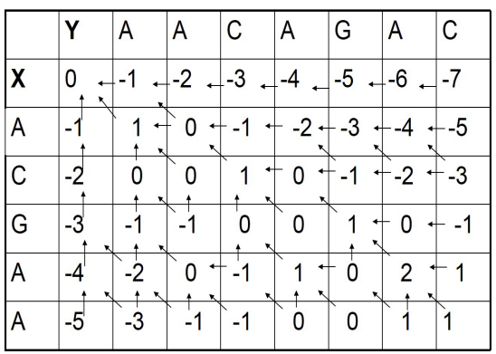
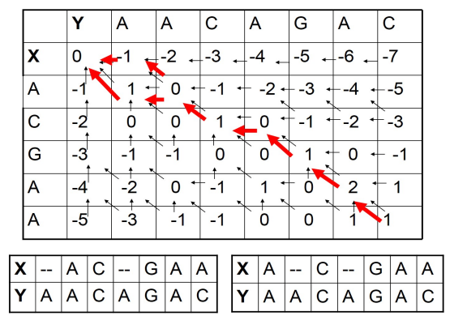

# Mathematical problems of alignment

Assume sequences $X=(X_1,\dots,X_m)$ and $Y=(Y_1,\dots,Y_n)$ with length m and n. The target is to find a best global alignment, which is to add some indels to 'fit' the best. The question is: what's the scoring function? what's the algorithm?

One simple function: If mismatches are penalized by $\mu$, indels are penalized by $\delta$, and matches are rewarded with 1, then the score is
$$\# \text{match}-\mu(\#\text{mismatch})-\delta(\#\text{indel}))$$

More complicated functions use **scoring matrices** to give penalties to substitutions: for amino acids PAM and BLOSUM. DNA is less conserved so at nucleotide level it's less effective to compare coding regions.

A refinement: a series of k indels come as a single event, rather than k independent event, so penalties for gaps can be further classified as **gap opening** and **gap extension**.

# Pairwise alignment

## Global alignment: Needleman-Wunsch algorithm

Let $F=(F_{i,j})$ be best alignment scores of subsequences $X_{1,i},Y_{1,j}$. F can be solved by recursion. $F_{m,n}$ is just what we want. In this case, rewards and penalties are all set to 1. The iteration function is:
$$F_{i,j}=\max \begin{cases}
F_{i-1,j}-d& \text{indel of Y}\\
F_{i,j-1}-d& \text{indel of X}\\
F_{i-1,j-1}+d_{ij} &\text{match/mismatch}
\end{cases}$$
where $d_{ij}$ is 1 for match and -1 for mismatch. For X=ACGAA and Y=AACAGAC, the iteration and traceback are shown below. Gap opening and gap extension can also be considered, with a 'status' parameter recoding if the last location is gap.

$$\begin{cases}
M(i,j) = S(x_i, y_j) +\max \left\{
\begin{array}{l}M(i-1,j-1) \\I_x(i-1,j-1) \\I_y(i-1,j-1)\end{array}\right. \\
I_x(i,j) = \max \left\{\begin{array}{l}M(i-1,j) - d \\I_x(i-1,j) - e\end{array}\right. \\
I_y(i,j) = \max \left\{\begin{array}{l}M(i,j-1) - d \\I_y(i,j-1) - e\end{array}\right.
\end{cases}$$

## Local alignment: Smith-Waterman algorithm

The **local alignment** of two sequences is to find a subsequence in each sequence so as the subsequences have the best global alignment. There are two variables in local alignment: the location and length of subsequences, so the initilization, iteration and traceback is different.

For initialization, all $F_{i,0}$ and $F_{0,j}$ is 0.For iteration,
$$F_{i,j}=\max \begin{cases}
F_{i-1,j}-d& \text{indel of Y}\\
F_{i,j-1}-d& \text{indel of X}\\
F_{i-1,j-1}+d_{ij} &\text{match/mismatch}\\
0 &\text{time for new start}
\end{cases}$$
For traceback, find the maximum in the matrix as the start point, and trace to 0.

## Alignment as pairwise HMM

# Multiple alignment: Profile HMM

A natural probabilistic model for a conserved region would be to specify independent probabilities $e_i(a)$ of observing nucleotide (amino acid) a in position i. The probability of a new sequence X according to this model is: 
$$P(X|M)=\prod_{i=1}^Le_i(X_i)$$
This kind of information is stored in **Position Specific Score Matrix(PSSM)**.

