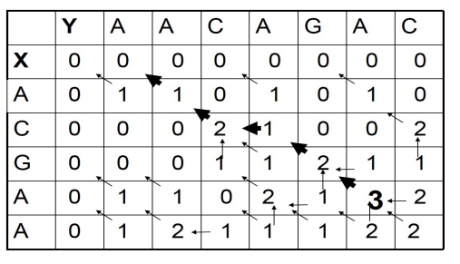

# Mathematical problems of alignment

Assume sequences $X=(X_1,\dots,X_m)$ and $Y=(Y_1,\dots,Y_n)$ with length m and n. The target is to find a best global alignment, which is to add some indels to 'fit' the best. The question is: what's the scoring function? what's the algorithm?

One simple function: If mismatches are penalized by $\mu$, indels are penalized by $\delta$, and matches are rewarded with 1, then the score is
$$\# \text{match}-\mu(\#\text{mismatch})-\delta(\#\text{indel}))$$

More complicated functions use **scoring matrices** to give penalties to substitutions: for amino acids PAM and BLOSUM. DNA is less conserved so at nucleotide level it's less effective to compare coding regions.

A refinement: a series of k indels come as a single event, rather than k independent event, so penalties for gaps can be further classified as **gap opening** and **gap extension**.

# Pairwise alignment

## Global alignment: Needleman-Wunsch algorithm

Let $F=(F_{i,j})$ be best alignment scores of subsequences $X_{1,i},Y_{1,j}$. F can be solved by recursion. $F_{m,n}$ is just what we want. In this case, rewards and penalties are all set to 1. The iteration function is:
$$F_{i,j}=\max \begin{cases}
F_{i-1,j}-d& \text{indel of Y}\\
F_{i,j-1}-d& \text{indel of X}\\
F_{i-1,j-1}+d_{ij} &\text{match/mismatch}
\end{cases}$$
where $d_{ij}$ is 1 for match and -1 for mismatch. For X=ACGAA and Y=AACAGAC, the iteration and traceback are shown below. Gap opening and gap extension can also be considered, with a 'status' parameter recoding if the last location is gap.

$$\begin{cases}
M(i,j) = S(x_i, y_j) +\max \left\{
\begin{array}{l}M(i-1,j-1) \\I_x(i-1,j-1) \\I_y(i-1,j-1)\end{array}\right. \\
I_x(i,j) = \max \left\{\begin{array}{l}M(i-1,j) - d \\I_x(i-1,j) - e\end{array}\right. \\
I_y(i,j) = \max \left\{\begin{array}{l}M(i,j-1) - d \\I_y(i,j-1) - e\end{array}\right.
\end{cases}$$

## Local alignment: Smith-Waterman algorithm

The **local alignment** of two sequences is to find a subsequence in each sequence so as the subsequences have the best global alignment. There are two variables in local alignment: the location and length of subsequences, so the initilization, iteration and traceback is different.

For initialization, all $F_{i,0}$ and $F_{0,j}$ is 0.For iteration,
$$F_{i,j}=\max \begin{cases}
F_{i-1,j}-d& \text{indel of Y}\\
F_{i,j-1}-d& \text{indel of X}\\
F_{i-1,j-1}+d_{ij} &\text{match/mismatch}\\
0 &\text{time for new start}
\end{cases}$$
For traceback, find the maximum in the matrix as the start point, and trace to 0.

## Alignment as pairwise HMM

- Hidden states: match(M), insertion in x(X), insertion in y(Y);
- Observation symbols: match(a,b), insertion in x(a,-), insertion in y(-,a)
- TPM$\begin{pmatrix}1-2\delta&1-\epsilon&1-\epsilon\\\delta&\epsilon&0\\\delta&\epsilon&0\end{pmatrix}$
- Emission probability: $P(M)=P_{x_i,y_j},P(X)=q_{x_i},P(Y)=q_{y_j}$. M can only emit M, and so on.

Here, for an alignment of AT-GTTAT and ATCGT-AC, the hidden state path is MMYMMXMM. Based on the HMM, each alignment of two DNA/protein sequences can be assigned with a probability score; Each “observation symbol” of the HMM is an aligned pair of two
letters, or of a letter and a gap. The Markov chain of hidden states should represent a scoring scheme reflecting an evolutionary model(somehow like K80, I guess). Transition and emission probabilities define the probability of each aligned pair of sequences. Given two input sequences, we look for an alignment of these two sequences of maximum probability.

For each pair of sequences x (of length m) and y (of length n), there are many alignments of x and y, each corresponds to a different state sequence (with the length between $\max(m, n)$ and $m + n$). Given the transmission and emission probabilities, each alignment has a defined score – the product of the corresponding probabilities. An alignment is “most probable”, if it maximizes this score.

**Viterbi algorithm**

Let $v^M(i, j)$ be the probability of the most probable alignment of $X(1, \cdots, i)$ and $Y(1, \cdots, j)$, which ends with a match (state M). Similarly, $v^X(i, j)$ and $v^Y(i, j)$, the probabilities of the most probable alignment of $X(1, \cdots, i)$ and $Y(1, \cdots, j)$, which ends with states $X$ or $Y$, respectively. Similar argument for $v^X(i,j)$ and $v^Y(i,j)$.
$$
v^M(i, j) = p_{X_i, Y_j} \max \left(
\begin{array}{c}
(1 - 2\delta) v^M(i-1, j-1) \\
(1 - \epsilon) v^X(i-1, j-1) \\
(1 - \epsilon) v^Y(i-1, j-1)
\end{array}
\right)\\
v^X(i, j) = q_{X_i} \max \left(
\begin{array}{c}
\delta v^M(i-1, j) \\
\epsilon v^X(i-1, j)
\end{array}
\right) \\
v^Y(i, j) = q_{Y_j} \max \left(
    \begin{array}{c}
\delta v^M(i, j-1) \\
\epsilon v^Y(i, j-1)
\end{array}
\right)
$$

Adding termination: The last transition in each alignment is to the END state, with probability $\tau$; For this, an END state is added, with transition probability $\tau$ from any other state to END. This assumes expected sequence length of $1/\tau$.Written in TPM of X, Y and END, 
$$A=\begin{pmatrix}1-\tau&\tau&0\\0&1-\tau&\tau\\0&0&1\end{pmatrix}$$
And full pair HMM model is shown below:

## Scoring an alignment: random alignment

We wish to know if the alignment score is above or below the score of random alignment of sequences with the same length. We need to model random sequence alignment by HMM, with end
state. This model assigns probability to each pair of sequences X and Y of arbitrary lengths m and n.

Thus, the probability of random X (length n) and Y (length m) is 
$$P(X,Y|random)=\eta^2(1-\eta)^{n+m}\prod_{i=1}^nq_{X_i}\prod_{j=1}^mq_{Y_j}$$
and the corresponding score is 
$$\log P=2\log \eta +(n+m)\log(1-\eta)+\sum_i^n\log q_{X_i}+\sum_j^m\logq_{Y_j}$$

# Multiple alignment: Profile HMM

A natural probabilistic model for a conserved region would be to specify independent probabilities $e_i(a)$ of observing nucleotide (amino acid) a in position i. The probability of a new sequence X according to this model is: 
$$P(X|M)=\prod_{i=1}^Le_i(X_i)$$
This kind of information is stored in **Position Specific Score Matrix(PSSM)**.

