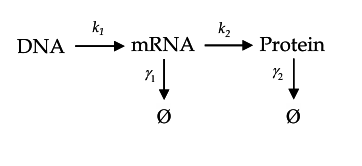

# Biophysics

This part is designed to examine your ability to modeling living systems and use mathematical and physical methods to solve problems. Here are some tips:

- Your CoT and solution steps should be shown.
- The final answer only takes up very few points, so don't bother with detailed numbers.
- We want to see your talented brain, so feel free if you think the problems can be extended, revised or sth like that.
- It is fine if you turn to AI and searching engines for help, but make sure you understand your answers. Copy-paste is not accepted, so make sure you thought through the problems.
- Some coding might be useful if you do not want to calculate and use numeral simulation instead, and that is also acceptable.

## 1. Single-cell Central Dogma

Most of you have taken courses like *College Physics*. In such courses, statistical mechanics is used to describe a system with a large amount of particles, so that you can ignore the uncertainty of single particle motion. However, in a living cell, ONE gene can only exist by TWO DNA copies and several RNA copies. Therefore, single-molecule dynamics is essential in understanding central dogma. This part guides you to explore it. The synthetic and degrade/dilute constant is in the diagram. **A useful tip: Time average is equivalent to ensemble average!** (adapted from PCCMB 2024 spring)

1. Derive that the lifetime of a SINGLE RNA molecule follows an exponential distribution with constant $\gamma_1$.
2. Derive the stable distribution of the number of RNA molecules.
   *Hint: Consider a system of states, with each state discribing # of molecules. The probability of states are continuous and equilibrium equation can be derived with $\frac{dp_m}{dt}=0$. The set of equations CAN be solved analytically. (The equation is called **Chemical Master Equation**)*
3. Since each mRNA molecule will be translated multiple times during its lifetime, over a long period protein molecules appear to be synthesized in “bursts”, with each mRNA transcript contributing one burst. Together with your answers in 1., derive the distribution of burst size(i.e. # of protein molecules synthesized in one burst), and calculate the mean.
   *Hint: You might need some math tricks.*

## 2. Boltzmann Statistics: 'Protein Folding' vs. 'Ligand Binding'

Assume there is a protein A with 10 'domains', and can bind to a specific ligand B. However, the protein can bind to B only when more than 5 domains are not folded, and the 'naked' length of the protein affects binding affinity('binding area') by function $p(l)=\frac{1}{M}(l-5)^2$(unit: domain) where M is the normalization factor. Moreover, ligand binding decreases the system energy by $\epsilon$. Use **Boltzmann statistics** to finish the problem:

1. Discrete condition: The protein domains usually need to be complete to function. The folding of each protein decreases the system energy by $\epsilon_0$. Let $M=25$, derive the probability of A binding to B, in terms of temperature T.
2. Continuous condition: Now assume each domain contains so many independent amino acids that the protein turns continuous changeable. Redo the problem in this condition. How do the answers differ?
3. (Extra) The normalization factor M is set invariable in previous problems. For a real system, we might expect it to respond to temperature sharply. Give a set of parameters $\epsilon$ and $\epsilon_0$, and some expression of M, so that the system could respond to temperature threshold T=311K(~38 Celcius). You should attach a figure of probability of binding against temperature in your answers.
   *Hint: What makes a Boltzmann statistics sensitive to T? Is M crucial in sensitivity?*

## 3. Dynamical Modeling of a System

One reason that ecosystems are hard to study is their complex dynamic behaviour. This problem gives you a peek into a simple ecosystem and let's see what will happen.

1. Assume there is only one species. Its population growth is controlled by the following factors: reproduction, proportional to population by factor $r$ and resource constraint, represented by maximum population $K$. Write out the differential equation obeyed by the system, and derive the solution. This is called the **Logistic function**.
2. Two species predating system: Consider a system of plant A and animal B. The growth of A is affected by its own population size and predator population size, parameters respectively $m$ and $n$. The growth of B is affected by its own deaths and food population size, with parameters $p$ and $q$. Show that this interaction could lead to oscillitory behaviours. 
   (Extra) Can you think of some similar expression to decribe systems with arbitrary number of species? Tell us about your ideas in detail. (You might 'invent' the gLV model by yourself!)
3. (Extra) Another view is to include **environment** explicitly, e.g. the Niche theory. Think of a way to model an ecosystem, and show the DEs of the system. The equations should have explicit environment terms. You should also explain your equations, so that we can easily get your idea. It is better if you can solve it and show its behaviours.

## 4. Capabilities

This part is not limited to any fields. All we want is your skills, your enthusiasm to think, ...So you can just show you are the best one for dry-lab-biophysics:

- Your advantages or strong abilities
- Your experiences in lab, project, etc.
- Your research interests and efforts
- Your biophysics work in your 2nd brainstorm
- Your ideas and opinions on biophysics in an iGEM project
- Your expected role in biophysics part
- ...........
